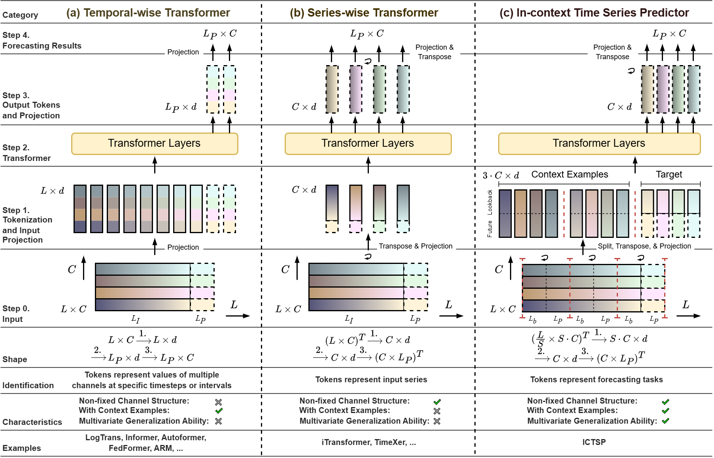

# In-context Time Series Predictor

This repository will host the code for our paper: [In-context Time Series Predictor](https://arxiv.org/abs/2405.14982).

## Code Release

This repository contains the in-development project code for the ICTSP model. We have currently released two codebases: one for the time series forecasting task (as described in the paper) and one for multi-task time series analysis. These can be found in the `ICTSP/` and `ICTSP-MultiTask/` folders respectively. Please refer to the README files in both folders for implementation details.

## Overall Architecture

